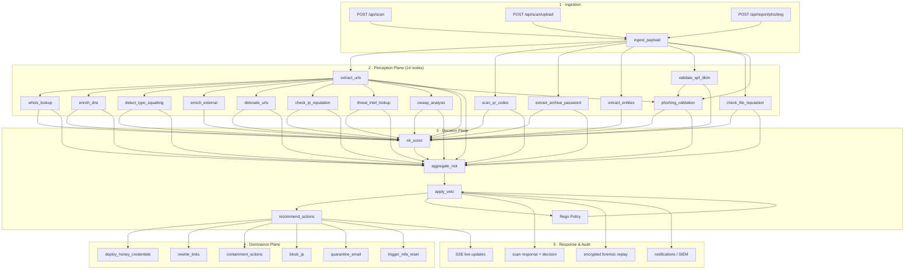

# Kestrel-SGR (APCS) — Autonomous Phishing Control System

[](https://github.com/rohit-barui/Kestrel-SGR/actions/workflows/ci.yml)
[](https://github.com/rohit-barui/Kestrel-SGR/actions/workflows/test.yml)
[](https://github.com/rohit-barui/Kestrel-SGR)
[](https://github.com/rohit-barui/Kestrel-SGR)
[](https://www.python.org/)
[](https://github.com/rohit-barui/Kestrel-SGR/pkgs/container/kestrel-sgr)
[](LICENSE)

**APCS** is a deterministic, multi‑plane security control system that detects, analyzes, predicts, and actively neutralises social‑engineering threats (phishing, smishing, vishing) across enterprise environments.

Built on a **Skill Graph Runtime (SGR)** — a Directed Acyclic Graph (DAG) executor that chains perception, decision, and dominance skills with schema validation, confidence aggregation, and saga-based rollback.

<p align="center">
  <a href="https://youtu.be/wF07MUFRXrQ">
    
  </a>
  <br>
  <em>Watch the Kestrel-SGR demo on YouTube</em>
</p>

---

## Features

- **Skill Graph Runtime** — 26-node DAG executor with JSON schema validation, confidence aggregation, and Celery-backed execution
- **IP & File Reputation** — VirusTotal, AbuseIPDB, AlienVault OTX lookups for IP addresses and SHA-256 file hashes
- **Threat Intelligence** — URL/domain IoC matching via OTX pulses and VirusTotal
- **OWASP Security Analysis** — 10 automated detectors covering OWASP Top 10 patterns (XSS, SQLi, SSRF, open redirect, …)
- **Phishing Validation** — brand-impersonation detection, SSL checks, and header-anomaly analysis
- **Customer Report Portal** — phishing report submission with optional auto-remediation and history
- **Email Security Integrations** — Microsoft Defender for Email and Cisco ESA adapters (quarantine, block sender, verdicts)
- **URL Detonation Engine** — Multi-link reputation analysis via CyberWatch API + local heuristics (malicious/suspicious/safe classification)
- **File Upload Scanning** — Upload `.eml`, `.txt`, `.msg`, `.html` files for automatic pipeline analysis
- **Multi-Signal Risk Scoring** — 20+ signals including detonation, SPF/DKIM/DMARC spoof flags, ML risk score, OWASP, IP/file reputation, and threat-intel IoCs
- **Veto Overrides** — Hard deny on spoofed emails, malicious detonations, malicious reputation, phishing likelihood, or high ML risk
- **Lightweight Rego Policy Engine** — Python-based OPA evaluator with runtime policy updates
- **ML Scorer** — scikit-learn based risk estimation (displayed as ML Confidence)
- **Real-Time Dashboard** — Glassmorphic UI with D3.js DAG visualization, SSE live updates, replay, and analytics
- **Forensic Replay** — Encrypted trace store with step-by-step skill replay
- **SOAR Playbooks** — Action buttons to execute remediation (block, quarantine, MFA reset)
- **PII Redaction** — Automatic detection and redaction of PII before external processing
- **RBAC** — Token-based auth with Analyst and Admin roles
- **Transaction Saga** — Automatic rollback of side-effects on failure
- **506 passing tests** — 97.34% overall line coverage, ≥99% across all core and skills modules

---

## Quick Start

```bash
# Install from PyPI
pip install kestrel-sgr
kestrel-sgr

# Or run the published Docker image (built & pushed to GHCR by CI):
# docker run -p 9090:9090 ghcr.io/rohit-barui/kestrel-sgr:latest

# Or one-click install (creates venv, installs deps, starts server):
.\Kestrel-sgr.ps1
```

Open **http://localhost:9090** and enter the default Analyst token:
```
fe12751c01c2ad2a4f99004855697e18c173cfe54fdf57436b29f2a2923946b5
```

---

## How It Works — Flow Diagram



---

## Architecture

```
┌─────────────────────┐   ┌─────────────────────┐   ┌─────────────────────┐
│   Perception Plane  │   │   Decision Plane    │   │   Dominance Plane   │
│  (Ingestion, parse, │   │ (Risk scoring,      │   │ (Deception,         │
│   enrichment,       │   │  policy evaluation) │   │  containment)       │
│   reputation, OWASP)│   └───────┬─────────────┘   └───────┬─────────────┘
└───────┬─────────────┘           │                         │
        │                         ▼                         ▼
        └───────► SGR ◄───┌────────────────┐   ┌──────────────────────────┐
                         │ Core Package   │   │ Integrations              │
                         │ engine, policy,│   │ VT · AbuseIPDB · OTX ·    │
                         │ gateway, replay│   │ Defender · Cisco ESA      │
                         └────────────────┘   └──────────────────────────┘
```

### Planes

1. **Perception** — Ingests raw payloads, extracts URLs/QR codes/passwords, enriches with WHOIS/DNS, detects typo-squatting, extracts entities, detonates URLs, checks IP/file reputation, runs OWASP analysis, and validates phishing signals
2. **Decision** — Aggregates risk from 20+ signals, applies veto overrides and Rego policy, recommends actions, validates SPF/DKIM/DMARC
3. **Dominance** — Deploys honey credentials, rewrites links, blocks IPs, quarantines emails, triggers MFA resets, and remediates via Defender/Cisco ESA

---

## API Endpoints

| Method | Path | Auth | Role | Description |
|--------|------|------|------|-------------|
| `POST` | `/api/scan` | Yes | Any | Run SGR pipeline on email/SMS/voice/URL payload |
| `POST` | `/api/scan/upload` | Yes | Any | Upload `.eml`/`.txt`/`.msg`/`.html` for scanning |
| `POST` | `/api/detonate` | Yes | Any | Batch URL/domain reputation analysis |
| `POST` | `/api/reputation/ip` | Yes | Any | On-demand IP reputation check |
| `POST` | `/api/reputation/file` | Yes | Any | On-demand file-hash reputation check |
| `POST` | `/api/owasp/scan` | Yes | Any | On-demand OWASP pattern scan |
| `POST` | `/api/report/phishing` | Yes | Any | Submit customer phishing report (+ optional auto-remediate) |
| `GET` | `/api/reports` | Yes | Any | List phishing report history |
| `POST` | `/api/check-pii` | Yes | Any | PII redaction check |
| `POST` | `/api/webhook` | No* | — | External event receiver (APCS signature verified) |
| `GET` | `/api/scenarios` | Yes | Any | List preset threat scenarios |
| `GET` | `/api/health` | No | — | Liveness probe (version, uptime) |
| `GET` | `/api/stats` | Yes | Any | Aggregate scan statistics |
| `GET` | `/api/trend` | Yes | Any | Risk trend data |
| `GET` | `/api/replay/<id>` | Yes | Any | Forensic trace by scan ID |
| `GET` | `/api/metrics` | No | — | Prometheus-compatible counters |
| `GET` | `/api/policies` | Yes | Admin | Retrieve Rego policy |
| `PUT` | `/api/policies` | Yes | Admin | Update Rego policy (hot-reload) |
| `GET` | `/api/integrations` | Yes | Admin | View vault config |
| `PUT` | `/api/integrations` | Yes | Admin | Save integration secrets |
| `POST` | `/api/auth/login` | No | — | Validate token |
| `POST` | `/api/auth/token/generate` | Yes | Admin | Generate new API token |
| `POST` | `/api/action` | Yes | Any | Execute SOAR playbook action |
| `POST` | `/api/analytics/quality` | Yes | Any | Submit false positive feedback |
| `GET` | `/events` | No | — | Server-Sent Events stream |
| `GET` | `/api/export/csv` | Yes | Any | Download CSV export |
| `GET` | `/api/export/report` | Yes | Any | Download summary report |

---

## Repository Structure

```
Kestrel-SGR/
├── server.py                 # REST API + static router
├── core/                     # Core runtime (engine, policy, gateway, detonation, integrations, etc.)
├── skills/                   # DAG skill nodes (perception, decision, dominance, reputation, owasp)
├── policies/                 # Rego policy files
├── web/                      # Dashboard frontend (HTML/JS/CSS)
├── tests/                    # 506 unit & integration tests
├── docs/                     # Documentation
├── docker/                   # Docker + load-test config
├── ci/                       # Coverage gate script
├── Kestrel-sgr.ps1           # One-click installer
└── requirements.txt
```

---

## Documentation

| Document | Description |
|----------|-------------|
| [Architecture](docs/ARCHITECTURE.md) | HLD, LLD, data flow, core components |
| [Core Package](docs/CORE.md) | Detailed module documentation |
| [Skills Package](docs/SKILLS.md) | All 26 DAG nodes and risk scoring formulas |
| [Policy Files](docs/POLICIES.md) | Rego rules and policy management |
| [Web UI Guide](docs/WEB_UI.md) | Dashboard features and development |
| [Usage Guide](docs/USAGE.md) | Complete walkthrough with API examples |
| [Testing Guide](docs/TESTING.md) | Test suite, coverage requirements |
| [Contributing](docs/CONTRIBUTING.md) | Workflow, code style, PR checklist |
| [v0.5 Roadmap](docs/ROADMAP_v0.5.md) | Next-version capability plan |
| [Change Log](CHANGELOG.md) | Version history |

---

## Coming Soon (v0.6.0)

- **ML Model Retraining** — Extend feature extractor with v0.5 signals (IP/file reputation, OWASP risk, threat-intel IoC matches, phishing validation) and retrain the RandomForest risk scorer
- **Integration Health Probes** — Per-provider connectivity checks (VirusTotal, AbuseIPDB, OTX, Defender, Cisco ESA) via `/api/integrations/health` with dashboard readiness status
- **Phishing Report Automation** — Persistent report store with `report_id`, status tracking, and automatic Defender/Cisco ESA remediation dispatch on `auto_remediate=true`
- **Docker/K8s Deployment Docs** — Compose files, Helm chart, and vault-backed secret injection guides for new integration credentials
- **GitHub Project Board** — Sprint planning board (manual setup required; `gh` token lacks `project` scope)

---

## License

GNU Affero General Public License v3.0 — see `LICENSE` for details.

## Owner

**Rohit Barui** — [GitHub](https://github.com/rohit-barui)