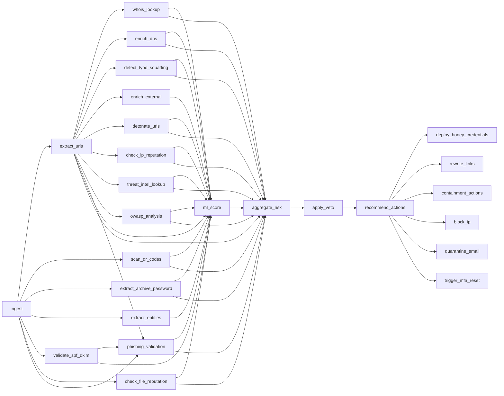

# Architecture Overview

## High-Level Design (HLD)

Kestrel-SGR is a modular Security Governance Runtime that ingests email payloads, enriches them, scores risk, decides action, and optionally escalates to external SIEMs.

**Four Planes:**
1. **Perception** — ingestion & enrichment (URL extraction, QR scan, WHOIS, DNS, typo-squatting, archive password, entity extraction, URL detonation, SPF/DKIM validation, IP/file reputation, threat intelligence, OWASP analysis, phishing validation)
2. **Decision** — risk aggregation, veto, Rego policy evaluation, action recommendation
3. **Dominance** — containment (IP block, quarantine, honey-creds, link rewrite, MFA reset, Defender/Cisco ESA remediation)
4. **Policy Integration** — Rego policies governing allow/deny decisions

**Core Services:**
- REST API (`server.py`) — scan, detonate, reputation, owasp, report, policy, integrations, replay, health, SSE
- SIEM connectors (`core/siem_connectors.py`) — Splunk, Elastic
- Forensic replay (`core/replay.py`) — encrypted trace store
- Authentication (`core/auth.py`) — token-based RBAC
- Secrets management (`core/vault.py`) — encrypted JSON backend
- Integration adapters (`core/integrations/`) — VirusTotal, AbuseIPDB, AlienVault OTX, Defender, Cisco ESA

## Low-Level Design (LLD)

### Core Components

- **engine.py** — DAG executor with schema validation, confidence aggregation, error handling
- **policy.py** — Lightweight Rego compiler/interpreter (subset of OPA Rego)
- **gateway.py** — Saga pattern: records side-effects, rolls back on failure
- **detonation.py** — URL reputation engine (CyberWatch API + local heuristics)
- **reputation.py** — IP/file reputation, threat intel, phishing validation skills
- **replay.py** — Encrypted SQLite store with Fernet encryption and background purge
- **auth.py** — Token manager with role-based access (Analyst, Admin)
- **vault.py** — Secrets manager with JSON file backend (pluggable for Azure/HashiCorp/AWS)

### Data Flow

```
Raw Payload → Perception Plane → Decision Plane → Dominance Plane → Action
                  │                     │                │
                  ▼                     ▼                ▼
            URL Extraction         Risk Scoring    IP Block / Quarantine
            WHOIS/DNS Enrich       Veto Override   Link Rewrite
            Detonation             Policy Eval     MFA Reset
            IP/File Reputation     Action Reco     Defender / Cisco ESA
            OWASP / Phishing       Aggregation     Honey Creds
            Threat Intel           Confidence
```

### DAG Flow (26 Nodes)



1. **Ingestion** — `perception.py` reads raw payloads (email/SMS/voice/URLs), extracts artifacts
2. **Enrichment** — External lookups (DNS, WHOIS, CyberWatch, VirusTotal, AbuseIPDB, OTX) with caching
3. **Reputation & Validation** — IP/file reputation, threat-intel IoC matching, OWASP analysis, phishing-validation signals
4. **Detonation** — URL reputation analysis with per-URL classification
5. **Decision** — `decision.py` builds risk vector from 20+ signals, applies veto and Rego policy, recommends actions
6. **Remediation** — `dominance.py` performs containment actions via saga gateway (with Defender/Cisco ESA adapters)
7. **Audit** — All events recorded in encrypted replay store; SSE broadcasts for live dashboard

### Persistence

| Store | File | Encryption | Purpose |
|-------|------|-----------|---------|
| Secrets Vault | `data/secrets.json` | No (file perms) | API keys, webhook URLs, integration secrets |
| Replay DB | `data/replay.db` | Fernet (AES-128) | Scan traces for forensics |
| WHOIS Cache | `data/whois_cache.db` | Fernet (AES-128) | Cached WHOIS lookups |

### API Security

- **Authentication**: Bearer token in `Authorization` header or `token=` URL parameter
- **RBAC**: Analyst (default) and Admin roles; policy/integration/token-generation endpoints require Admin
- **Rate Limiting**: 1000 requests/min per client IP
- **HMAC**: Optional `X-HMAC` header verification for webhook endpoints
- **mTLS**: Optional client certificate verification via `--client-ca` flag

### Deployment

- **Container**: Python 3.11-slim, port 9090; image published to `ghcr.io/rohit-barui/kestrel-sgr`
- **Reverse Proxy**: NGINX with TLS 1.2/1.3, strong ciphers
- **Certificates**: Self-signed via `scripts/generate_cert.py` (replace with real CA in production)
- **Persistence**: `./data` volume mounted into containers
- **Orchestration**: Docker Compose for dev, Kubernetes-ready

---

For detailed module documentation see [CORE.md](CORE.md) and [SKILLS.md](SKILLS.md).